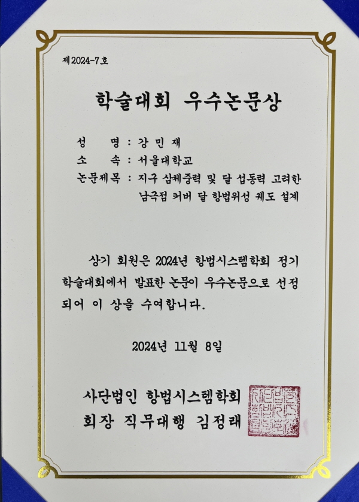
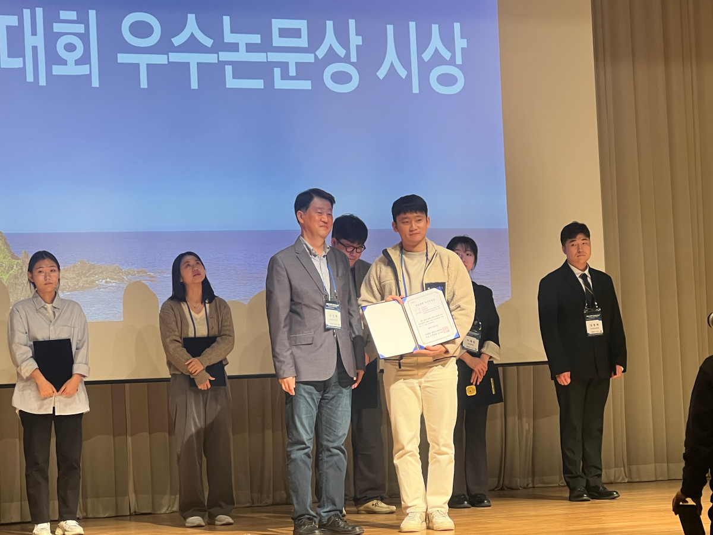
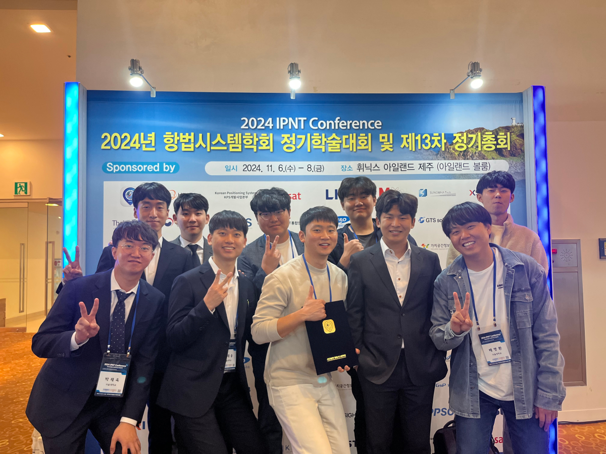

## 2024 항법시스템학회 정기학술대회 우수논문상 수상 
## 2024 IPNT Best Paper Award
 

- 강민재 석사과정이 2024년 11월 6-8일 제주 휘닉스 아일랜드에서 개최된 2024년 항법시스템학회 정기학술대회에서 "지구 삼체중력 및 달 섭동력 고려한 남극점 커버 달 항법위성 궤도 설계" 논문을 발표하고 우수논문상을 수상하였다.

 <!--  -->
 
 