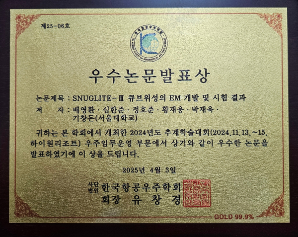

## 2024년 한국항공우주학회 추계학술대회 우수논문발표상 수상
## 2024 KSAS Best Paper Presentation Award
 

- 배영환 박사과정이 2024년 11월 13~15일에 개최된 2024년 한국항공우주학회 춘계학술대회 우주임무운영 부문에서 발표하였던 "SNUGLITE-III 큐브위성의 EM 개발 및 시험 결과" 논문에 대해 우수성을 인정받아 우수논문발표상을 수상하였다.

 <!--  -->
 
 <!--  -->