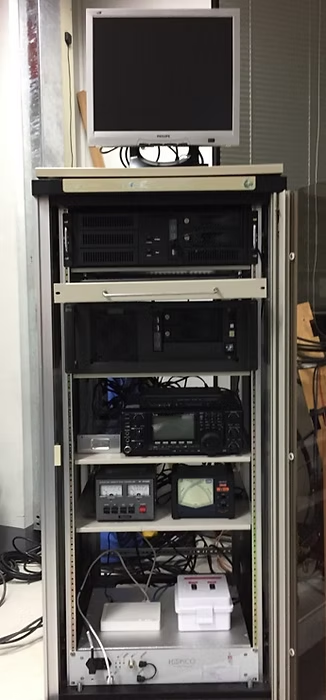

<!-------------------------------------------------------------------------------------->

### SNU Ground Station

<figure style="text-align: center;">

 
*지상국 정보*

</figure>

> Antenna
  - UHF antenna: 436CP42UG w/ polarity SW (M2 Inc.)
  - VHF antenna: 2MCP22 w/ polarity SW (M2 Inc.)
  - L/S-band antenna: MANTL24 w/ order made L/S feeder (SatService GmbH) and order made band-pass filter (CONTEC)

> Rotator
  - G-5500 (Yaesu)

> Preamplifier
  - SP-2000 (SSB electronics GmbH)
  - SP-7000 (SSB electronics GmbH)

> Transceiver
  - IC9100 (Icom Inc.)
  - HISPICO S-band receiver (IQ wireless GmbH)

> TNC
  - KAM-XL (Kantronics)