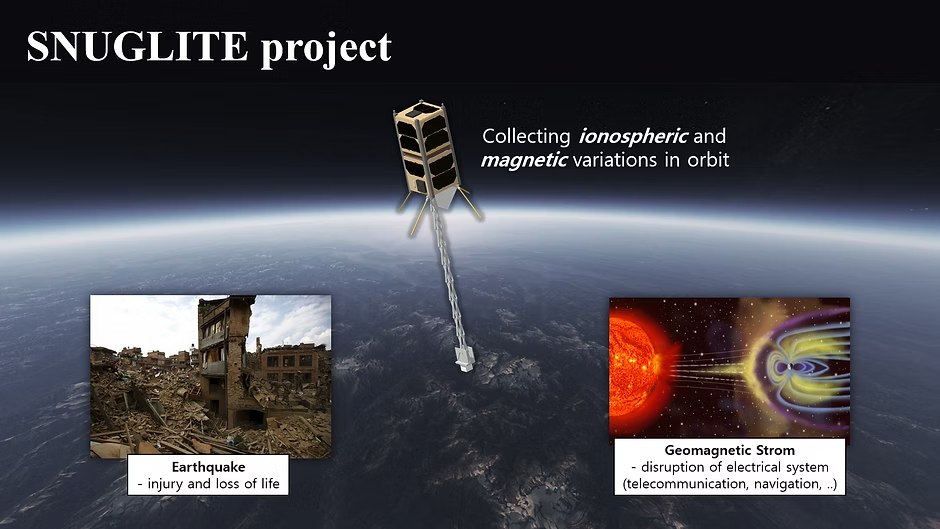

<!-------------------------------------------------------------------------------------->

### Seoul National University GNSS Laboratory Satellite (SNUGLITE)-I Project
  - 2U CubeSat mission (Launch: Dec 2018)
  - Funded by *Korea Aerospace Research Institute (KARI)*
  - Finalist in the *2015 Korea CubeSat Competition*

<figure style="text-align: center;">

 
*SNUGLITE-I 임무 개념도*

</figure>

### SNUGLITE-I CubeSat

> System
- 2U CubeSat
- Main payloads: L1/L2C GPS receiver x2
- Sub payloads:
   3-axis fluxgate magnetometer w/ deployable boom
- Mass: 1.9 kg
- Orbit: SSO 575km (LTDN 10h30m)​
> Frequency:
- UHF (437.275MHz) 
   * downlink : beacon, command-return
   * uplink : tele-command
- S-band (2405MHz)
   * downlink : housekeeping data, mission data