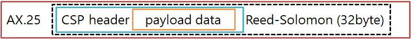
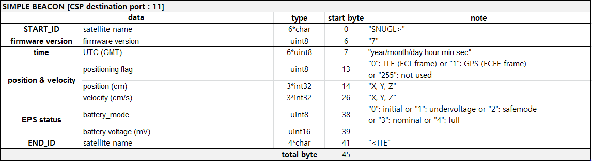
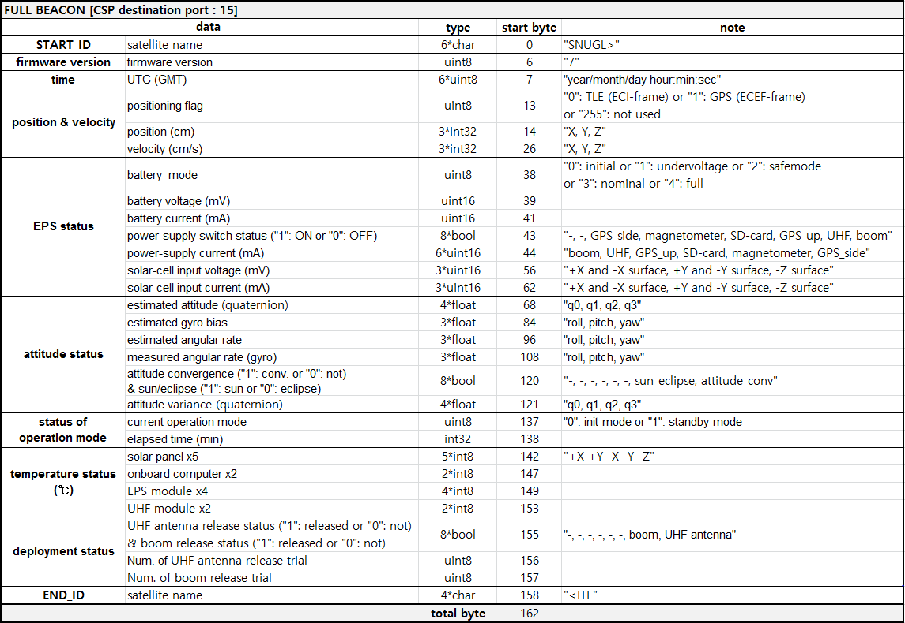

<!-------------------------------------------------------------------------------------->

### Seoul National University GNSS Laboratory Satellite (SNUGLITE)-I Project
  - 2U CubeSat mission (Launch: Dec 2018)
  - Funded by *Korea Aerospace Research Institute (KARI)*
  - Finalist in the *2015 Korea CubeSat Competition*

<figure style="text-align: center;">

 
*SNUGLITE-I Mission Concept*

</figure>

### System
- 2U CubeSat
- Main payloads: L1/L2C GPS receiver x2
- Sub payloads:
   3-axis fluxgate magnetometer w/ deployable boom
- Mass: 1.9 kg
- Orbit: SSO 575km (LTDN 10h30m)​
### Frequency:
- UHF (437.275MHz) 
   * downlink : beacon, command-return
   * uplink : tele-command
- S-band (2405MHz)
   * downlink : housekeeping data, mission data

### Beacon Structure
- downlink frequency: 437.275MHz
- modulation: GMSK
- baudrate: 9600bps
- protocol : AX.25 and CSP (cubesat space protocol)

<figure style="text-align: center;">

 
*message structure*

</figure>

- Payload data is covered by 4-byte header of  CSP (https://en.wikipedia.org/wiki/Cubesat_Space_Protocol). 
- 32 byte Reed-Solomon (223, 255) block code is applied from CSP header to the end of payload data and added to the end of payload data.
- AX.25 protocol is also used with the header and beginning and ending of "0xC0".
-  There are two types of payload data: simple beacon (length: 45 byte) and full beacon (162 byte).
- In stand-by operation mode, the period of simple beacon and full beacon is 10 sec and 30 sec, respectively. And full beacon is prior than simple beacon.
- One of interesting is that all beacons include the position and velocity of satellite using own developed GPS receivers!

<figure style="text-align: center;">

 
*Structure of simple beacon (45 bytes)*

 
*Structure of full beacon (162 bytes)*

</figure>

- If you receive any signals from SNUGLITE cubesat, please let us know!
- All the data which you send us will be helpful to our research. (Earth quake detection, Space environment observation, Satellite monitoring and so on)
- We would appreciate it if you send us as much data as possible. Also, if any paper utilizes your data, we will provide a certificate that your data has helped with the paper. (e-mail: snuglite@gmail.com)

 

2018/12/12  
Object AC is the closest to SNUGLITE.