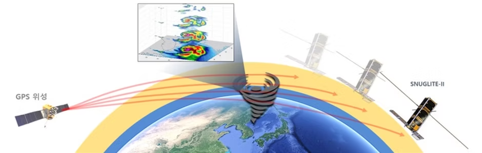

<!-------------------------------------------------------------------------------------->

### Seoul National University GNSS Laboratory Satellite (SNUGLITE)-II Project
  - 3U CubeSat mission (Launch: Jun 2022)
  - Funded by *Korea Aerospace Research Institute (KARI)*
  - Finalist in the *2019 Korea CubeSat Competition*

<figure style="text-align: center;">

 
*SNUGLITE-II 임무 개념도*

</figure>

### SNUGLITE-II CubeSat

> System
- 3U CubeSat
- Main payloads: L1/L2C GPS receiver x3
- Mass: 3.15 kg
- Orbit: SSO 700km
> Frequency:
- UHF (436.4MHz) 
   * downlink : beacon, command-return
- VHF (145.9MHz) 
   * uplink : tele-command
- S-band (2405MHz)
   * downlink : housekeeping data, mission data