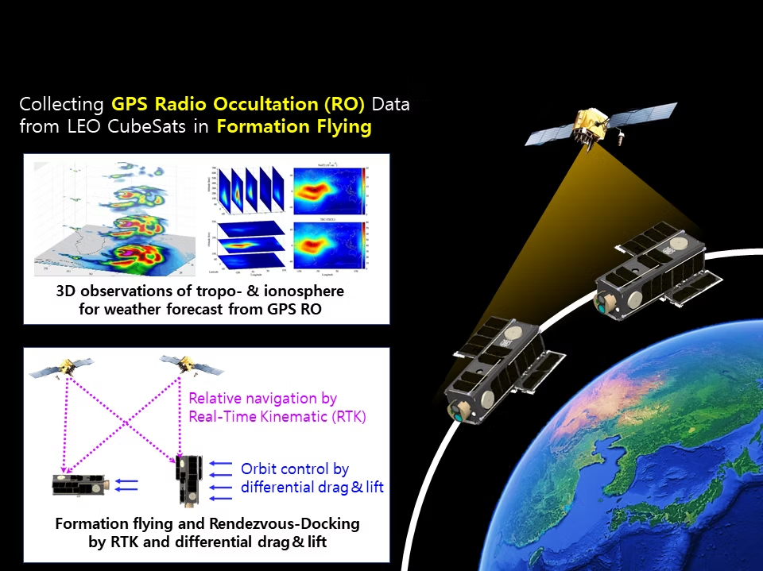

<!-------------------------------------------------------------------------------------->

### Seoul National University GNSS Laboratory Satellite (SNUGLITE)-III Project
  - 3U+3U CubeSat mission (Launch: Nov 2025)
  - Funded by *Korea Aerospace Research Institute (KARI)*
  - Finalist in the *2022 Korea CubeSat Competition*

<figure style="text-align: center;">

 
*SNUGLITE-III 임무 개념도*

</figure>

### SNUGLITE-III CubeSat

> System
- 3U+3U Twin CubeSat 
- Main payloads: 
  * L1/L2C GPS receiver x3
  * Inter-satellite link module
  * Electomagnetic docking device
- Mass: 3.2 kg
- Orbit: SSO 600km (LTAN 12h30m)​
> Frequency:
- UHF (MHz) 
   * downlink : beacon, command-return
   * uplink : tele-command
- S-band (2405MHz)
   * downlink : housekeeping data, mission data