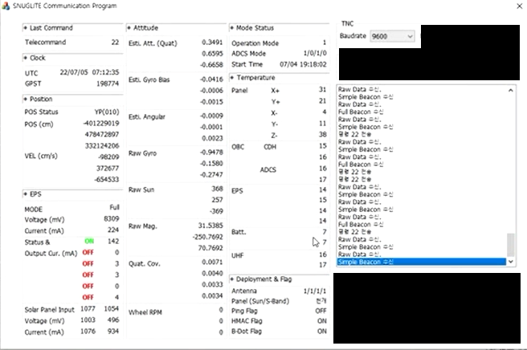

<!-------------------------------------------------------------------------------------->

서울대학교 SNUGLITE팀(항공우주공학과 기창돈 교수 연구팀)은 지난 7월 4일 오전 3시 27분경 서울대학교 신공학관(302동)에 위치한 지상국과의 첫 양방향 교신에 성공한데 이어, 오늘 16시 4분 교신에서 위성 전원이 켜진 순간부터 현재까지 상황 기록(300개)을 모두 수신하였다.

오늘 수신한 위성 상태 기록을 점검한 결과, 위성 전기부의 이상으로 초기 안테나 전개의 문제가 있음을 확인하였으며, 위성 초기화 명령을 통해 위성이 정상 작동하는 것을 확인하였다.

오늘 16시 4분 교신(한국상공 45도 각도로 통과)에서는 위성의 상태정보를 43회 수신하였으며, 위성에 명령을 4회 송신하여 양방향 교신이 이뤄짐을 재확인했다.

오늘 17시 54분 교신(한국상공 15도 각도로 통과)에서는 위성의 상태정보를 20회 수신하였다. 

양방향 교신의 기능적 점검을 확인한 서울대 SNUGLITE팀은 향후 약 2달간 위성의 부품들의 기능들을 점검하기 위한 명령들과 데이터를 주고받는 작업을 시작한다.

 <!--  -->