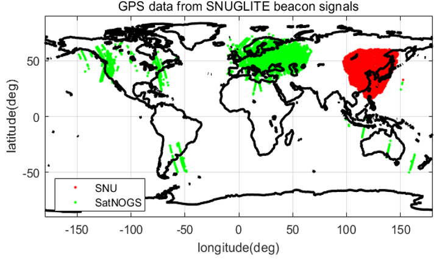

<!-------------------------------------------------------------------------------------->

- SNUGLITE boroadcasts its health and several data at every 10 seconds. Any one could receive the data using UHF antenna and receiver. Following picture is the number of received beacon data form SNUGLITE cubesatellite. Data were collected with SNU(Seoul National University) ground station and Satnogs amatuers. Satnogs is an open source ground station. We really appreciate to Satnogs efforts. 

- In SNUGLITE beacon data, you could find the GPS navigation solutions. We display the satellite position using the beacon data. The ground track will allow you to find out who received the beacon.

<figure style="text-align: center;">

 
*Locations of Amateurs who Received the SNUGLITE-I Beacon Data*

</figure>