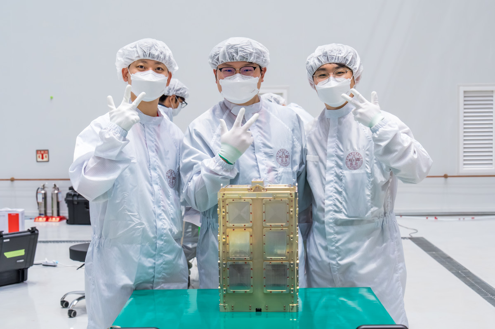
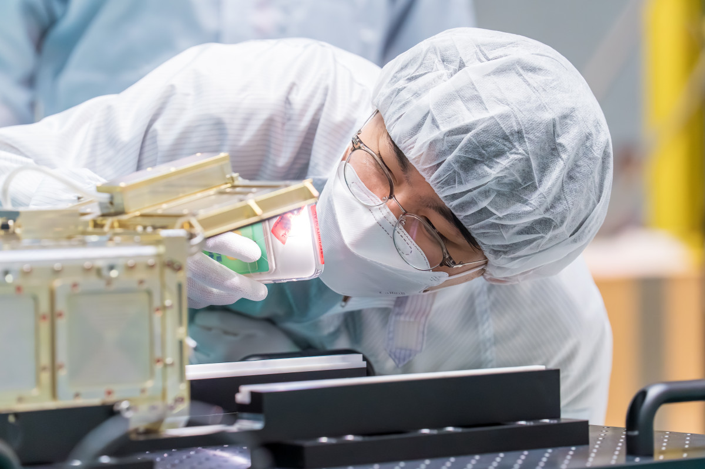

<!-------------------------------------------------------------------------------------->

# SNUGLITE-III 하나, 두리 최종 탑재 완료
SNUGLITE-III 하나와 두리는 2025년 11월 7일 나로우주센터에서 최종적으로 탑재를 완료했다. 누리호(4차 발사)는 11월 27일(목) 새벽 00시 54분부터 01시 14분 사이에 고도 600 km의 태양동기궤도(LTAN 12:30)로 향할 예정이다.

# Final Integration of SNUGLITE-III Hana and Duri
SNUGLITE-III Hana and Duri successfully completed their final integration at the Naro Space Center on 7 November 2025. The fourth launch of the Nuri vehicle is scheduled for the early hours of Thursday, 27 November, between 00:54 and 01:14, targeting a 600-km Sun-synchronous orbit with an LTAN of 12:30.

<figure style="text-align: center;">

    
*[누리호4차] 대한민국 위성 13개 진짜 로켓 배송 시작! 누리호 위성 탑재 완료*

(사진제공-한국항공우주연구원)

(사진제공-한국항공우주연구원)

(사진제공-한국항공우주연구원)

(사진제공-한국항공우주연구원)

</figure>